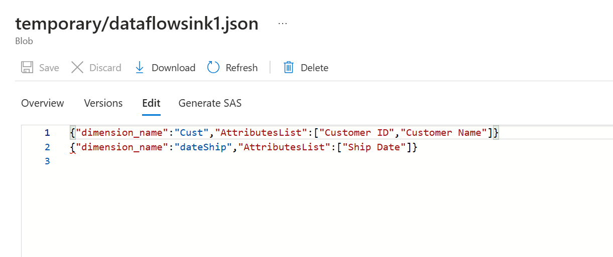

# A generic solution for integrating data into BI datawarehouse using Azure
## Introduction

This project is about developing a generic solution that enables data integration into BI datawarehouses.

I decided to do this project because :
- I don't have any existing project to follow. Everything from scratch.
- It will let me to start mastering different Azure's tools and discover their limitations (especially ADF)

This project is not finished yet. I will keep developing other functionalities.

The tools used are : 
- Azure Data Factory
- Azure Data Lake Storage Gen2
- Azure Databricks
- Azure Synapse Analytics
- Power BI

Next, a short resume of the main titles of my project

## Data Architecture

What is the project about ? 
  - Starting with raw data, output of a Flask API (developed by me)
  - Azure Data Factory (ADF): Ingests raw data into ADLS and orchestrating pipelines 
  - Azure Databricks: Processing data using complex manipulations and loading the output to ADLS.
  - Azure Synapse Analytics : to create lake database on sink data
  - Power BI: Visualizes insights.

The Data Architecture is next :

*Schema draw copyrights to **Kaouthar EL BAKOURI** [(medium's source)](https://medium.com/@kwtrelbakouri1/azure-end-to-end-data-engineering-project-harnessing-the-github-student-pack-for-students-and-be61227ccef2)

## Steps

### Creating a resource group

The first step is to create a resource group, defining its name and region. This resource group serves as a container for organizing and managing related Azure resources efficiently.

### Creating a storage account

Next, We need to create an Azure Data Lake Storage ADLS (a storage account with namespace hierarchy enabled).

Then, a container should be created and three directories should be added as shown next : source, sink and temporary.

### Azure Data Factory in action
#### Ingest raw data to ADLS

ADF is used to ingest raw data to ADLS directory "source", from the project's Github repository. A pipeline was developed for this purpose.

First, we created a HTTP linked service because raw data to ingest is in a Github repo and a ADLS linked service pointing to the container "hqfolder" in ADLS

Then, we defined 4 datasets in total, 2 datasets (dictionnary and raw_flat_file) with the HTTP linked source and 2 datasets (dict and raw_csv) with the ADLS linked source.

  

Finally, we created the pipeline with 2 copy activities and configured them correctly to ingest raw data to source directory on ADLS.

  

#### Retrieve dimensions attributes from JSON file (raw data)

The JSON file is composed of information inserted by the user of the Flask API. This information contains the structure of the datawarehouse that the user wants to have.
For more details, please look at the JSON File in the github repo.

Dimensions's details is among this information. The goal here is to have as an output, all the dimensions that are not Date dimensions and their list of attributes.
For the dimensions that are of type Date, we will process them in the Databricks notebook later.

To do so, we had to develop a Data Flow activity as presented next.

  

We used many type of activities : 
- Source
- Select
- Flatten
- Conditional split
- Aggregate
- Sink

The output of this pipeline is written in a JSON file in ADLS, in directory "temporary".
Next is a view of the output.

  

#### Data Processing with Databricks

With raw data in source directory and the JSON file created using the last pipeline, I need to use another tool to do complex transformation. 
 
 In fact, I tried first to only use ADF activites to reach my goal of dynamically selecting specific columns (dynamic parameter) of the data to process but maybe it's not possible in ADF yet.
 
 Because of this, I tried to use an Azure Function app (first time ever) because it's cost-effective and in my case, 
I don't need to the power of big data processing. But I faced a technical problem (loss of functions created in the app suddenly). I will look at this issue in another time.
 
 I choosed Databricks's notebook at the end and developed all the **dynamic** transformation actions needed for dimensions data and for facts data.

Mainly, the steps to follow  are :
- Create a Databricks resource
- Create a compute cluster
- Allow access to data source on ADLS from Databricks using an App Registration resource and configuring IAM on storage account
- Create a notebook (connected to the cluster) to process and transform data of the raw layer to the transformed layer on ADLS's container
- Execute the notebook

The code in the notebook will be enhanced and optimized later. For more details, the notebook is available in the repo.

### Orchestration using ADF

We will execute all the data pipelines mentionned above in one orchestrated pipeline using ADF as mentionned next.

Later, with creating a trigger, we can execute the main pipeline.

The pipeline execution is succesful. In sink directory, we will have this folders containing data saved in csv format for dimensions and for the fact table.

And if we get into one of these folders (factsTable as an example), we will find these files and the part-000*.csv 
file that contains data for fact table ready to use.

### Azure Synapse Analytics to create lake database

The lake database was created on the files's folders in sink directory, manually. The goal is to automate this part later.

Here, we see external tables created for each file's data in sink directory.

### Power BI for data vizualisation

With Power BI Desktop, we connect to Azure Synapse Analytics, specifically to the lake database created earlier.

Then, we need to define the join keys of tables.

Finally, we can start creating graphics in the dashboard.

