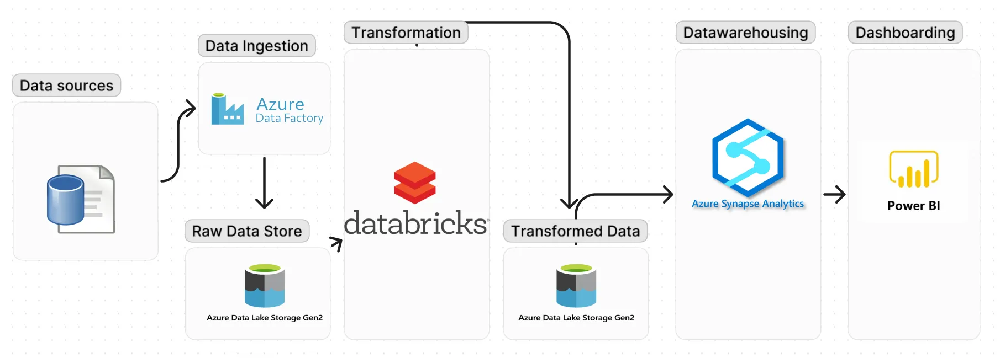
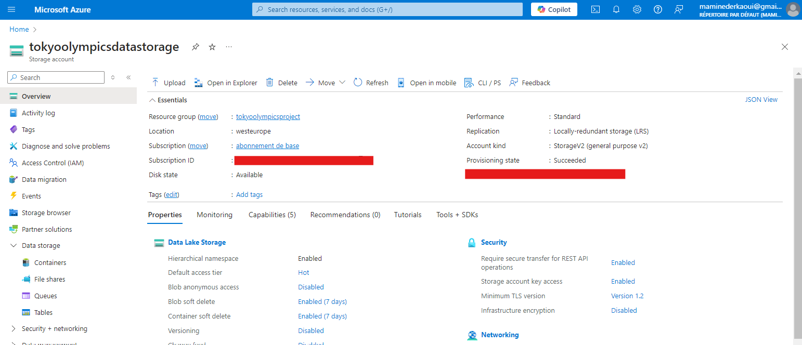
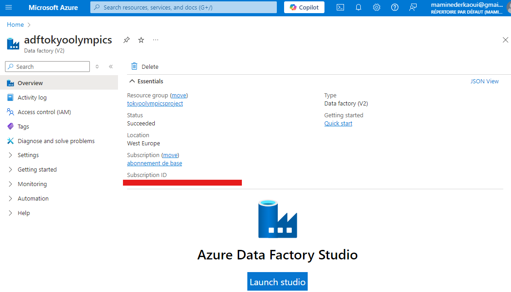
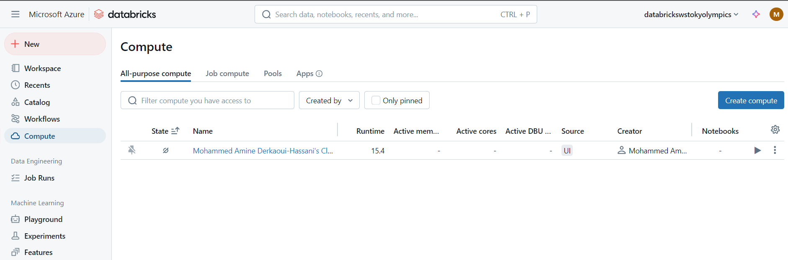

# Tokyo Olympics 2021 data with Azure
## Introduction

After I got my Azure Data Engineer Associate certification (DP-203) working with Microsoft learn materials, I needed to start working on end-to-end projects to develop my skills with Azure and Data Engineering in whole. 

This first project gives an simple example on using many tools availbale on Azure on a set of data related to Tokyo Olympics 2021.

The tools used are : 
- Azure Data Factory
- Azure Data Lake Storage Gen2
- Azure Databricks
- Azure Synapse Analytics
- Power BI

The original project was done by Kaouthar EL BAKOURI (IBM Data Engineer) (her [medium](https://medium.com/@kwtrelbakouri1)'s profile ), big thanks to her.

Kaouthar did the project from scratch and I mostly followed her steps mentionned on her medium's [blog](https://medium.com/@kwtrelbakouri1/azure-end-to-end-data-engineering-project-harnessing-the-github-student-pack-for-students-and-be61227ccef2). For more details, I recommand you to look at her blog.

Next, a short resume of the main titles of my project

## Data Architecture

What is the project about ? 
  - Starting with raw data from kaggle's [dataset](https://www.kaggle.com/datasets/arjunprasadsarkhel/2021-olympics-in-tokyo)
  - Azure Data Factory (ADF): Ingests data into the raw layer of Azure Data Lake Storage (ADLS).
  - Azure Databricks: Refines the dataset and stores processed data in ADLS’s transformed layer.
  - Azure Synapse Analytics: Provides data warehousing and in-depth analysis for better insights.
  - Power BI: Visualizes insights, completing the process and offering a comprehensive view of the 2021 Olympics dataset.

The Data Architecture is next (copyrights to **Kaouthar EL BAKOURI**):

## Creating a resource group

The first step is to create a resource group, defining its name and region. This resource group serves as a container for organizing and managing related Azure resources efficiently.

## Creating a storage account

Next, We need to create an Azure Data Lake Storage ADLS (a storage account with namespace hierarchy enabled).

Then, a container should be created and  two directories should be added as shown next.

## Azure Data Factory in action

ADF is used to ingest raw data to ADLS directory "raw-data". 

One linked service as source of data was created to access data from the main path ([github repo](https://raw.githubusercontent.com/kaoutharElbakouri/2021-Olympics-in-Tokyo-Data/refs/heads/main/)) and using relative path to get data of each csv file (Athletes.csv as an example).
  And other linked services were created as a sink on ADLS container on directory "raw-data".

  

Pipelines on ADF workspace are created to ingest data to ADLS.

## Data Processing with Databricks

After ingesting data into the raw layer of Azure Data Lake Storage (ADLS), the next step is to process it with Databricks and store the results in the transformed layer of ADLS.

Steps to follow :
- Create a Databricks resource
- Create a compute cluster
- Allow access to data source on ADLS from Databricks using an App Registration resource and configuring IAM on storage account
- Create a notebook (connected to the cluster) to process and transform data of the raw layer to the transformed layer on ADLS's container
- Execute the notebook

*The cluster used of the Databricks resource*

*The notebook to process and transform data*
## Azure Synapse Analytics for a lake database

Now it's time to use ASA on the csv transformed files to create a lake database (an abstract database) and be able to apply SQL queries on data contained in the flat files and afterwards, to use Power BI.

## Power BI for data vizualisation

With Power BI Desktop, we connect to Azure Synapse Analytics and get to the table of the lake database created earlier and start creating dashboards for Business Intelligence matters.

